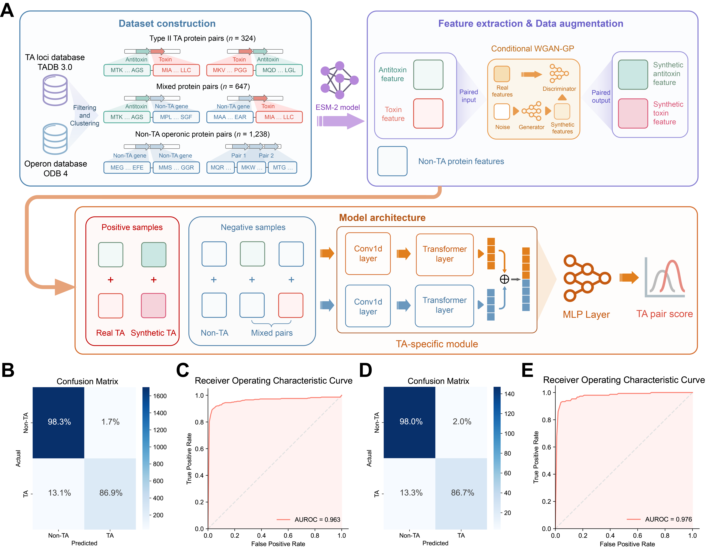

# DeepTAfinder

DeepTAfinder, a deep learning framework designed for the homology-independent identification of TA pairs. It integrates the pre-trained protein language model [ESM-2](https://github.com/facebookresearch/esm) with a TA-specific Siamese network and conditional GAN-based data augmentation. DeepTAfinder effectively captures order-aware features of TA pairs, achieving superior predictive performance and outperforming homology-based approaches. It also provides a genome prediction pipeline to identify putative type II TA pairs in bacterial genomes.



## Performance Comparison

We choose various model architecture with different pre-trained models and training strategies, and evalute their model capacity on cross-validation and independent testing. Performance metrics are reported in the table.

| Pre-trained   Model |           Strategy           |       ACC       |                |       F1       |                |      AUPRC      |                |
| :-----------------: | :---------------------------: | :-------------: | :-------------: | :-------------: | :-------------: | :-------------: | :-------------: |
|                    |                              |      Valid      |      Test      |      Valid      |      Test      |      Valid      |      Test      |
|          ESM-2          |           TA-specific module + GAN           |      **0.967**      |      **0.959**      |      **0.884**      |      **0.875**      |      **0.928**      |      **0.923**      |
|      ESM-2      |        TA-specific module        |      0.963      |      0.942      |      0.863      |      0.811      |      0.911      |      0.903      |
|       ESM-2       |        Fine-tuning        |      0.951      |      0.929      |      0.828      |      0.788      |      0.853      |      0.900      |
|       ESM-2       |        XGBoost        |      0.949      |      0.941      |      0.792      |      0.794      |      0.885      |      0.903      |
|       ESM-2       |          Linear probing          |      0.944      |      0.917      |      0.785      |      0.706      |      0.847      | 0.832 |

## Set up

### Requirements

- python==3.9.7
- torch==1.13.1
- biopython==1.79
- einops==0.6.0
- fair-esm==2.0.0
- tqdm==4.64.1
- numpy==1.23.5
- pandas==1.5.2
- scikit-learn==1.2.0
- matplotlib==3.6.3
- seaborn==0.13.0
- tensorboardX==2.5.1
- umap-learn==0.5.3
- warmup-scheduler==0.3
- emboss==6.5.7
- xgboost==2.1.4

While we have not tested with other versions, any reasonably recent versions of these requirements should work.

### Installation

As a prerequisite, you must have PyTorch installed. It is recommended to create a new virtual environment for installation. For model training and prediction from seperate protein sequence(s), You can use this one-liner for installation.

```shell
git clone https://github.com/gjh34/DeepTAfinder.git

cd DeepTAfinder
conda env create -f conda.yml -n DeepTAfinder
```

If you want to plot the sequence attention, you should install package `logomarker` first.

```shell
pip install logomaker
```

The weights of DeepTAfinder model can be downloaded from https://db-mml.sjtu.edu.cn/DeepTADB/DeepTAfinder/checkpoint.pt.

## Usage

### Train model

You can train the DeepTAfinder model by running `train.py` for cross-validation.

The weights of cWGAN-GP model can be downloaded from https://db-mml.sjtu.edu.cn/DeepTADB/DeepTAfinder/best_model_epoch17400.pth.

```shell
conda activate DeepTAfinder

BATCH_SIZE=32
NUM_WORKERS=4
SEED=421
MODEL=esm2model
LR=2e-5
ENC_LR=5e-5
WARM_EPOCHS=3
PATIENCE=5
LR_SCHEDULER=exp
LR_DECAY_STEPS=10
LR_DECAY_RATE=0.98
LR_DECAY_MIN_LR=5e-6
MAX_EPOCHS=500
WEIGHT_DECAY=1e-5
DROPOUT_RATE=0.4
GAN_BATCH_SIZE=4
GAN_DATA_PATH=dataset/GAN/best_model_epoch17400.pth
NUM_LAYERS=0
SUFFIX=model-${MODEL}_clflr-${LR}_enclr-${ENC_LR}_bs-${BATCH_SIZE}_wd-${WEIGHT_DECAY}_epo-${MAX_EPOCHS}_dropout-${DROPOUT_RATE}_warm-${WARM_EPOCHS}_patience-${PATIENCE}_lrscheduler-${LR_SCHEDULER}_lrdecayrate-${LR_DECAY_RATE}_lrdecaystep-${LR_DECAY_STEPS}_layers_${NUM_LAYERS}
LOG_DIR=log/$SUFFIX

cd DeepTAfinder

mkdir $LOG_DIR

for i in `seq 1 5`; do
    DATA_DIR=dataset/data/fold_${i}
    LOG_DIR_FOLD=$LOG_DIR/fold_${i}
    mkdir $LOG_DIR_FOLD
    time python train.py --model $MODEL \
    --batch_size $BATCH_SIZE \
    --num_workers $NUM_WORKERS \
    --seed $SEED \
    --lr $LR \
    --enc_lr $ENC_LR \
    --warm_epochs $WARM_EPOCHS \
    --patience $PATIENCE \
    --lr_scheduler $LR_SCHEDULER \
    --lr_decay_steps $LR_DECAY_STEPS \
    --lr_decay_rate $LR_DECAY_RATE \
    --lr_decay_min_lr $LR_DECAY_MIN_LR \
    --max_epochs $MAX_EPOCHS \
    --data_dir $DATA_DIR \
    --log_dir $LOG_DIR_FOLD \
    --weight_decay $WEIGHT_DECAY \
    --dropout_rate $DROPOUT_RATE \
    --num_layers $NUM_LAYERS \
    --stratified \
    --gan \
    --gan_batch_size $GAN_BATCH_SIZE \
    --gan_data_path $GAN_DATA_PATH \
    --mode train
    > $LOG_DIR_FOLD/log.txt 2>&1
done

python DeepTAfinder/plot_metrics.py -d log \
-s $SUFFIX \
-f 5 \
-p $PATIENCE \
-l $LOG_DIR
```

 Parameters:

- `--model` finetune a ESM-2 model.
- `--data_dir` directory that stores training data (default: ./data).
- `--num_layers` The number of layers to be fine-tuned in pre-trained model (default: 0).
- `--patience` patience for early stopping used in training (default: 5)。
- `--lr_scheduler` learning rate scheduler [step, cosine, exp].
- `--log_dir` directory that stores training outputs (default: logs).

### Prediction

You can predict type II TA pairs using a bacterial genome as input.

```shell
python DeepTAfinder.py -i examples/example.fasta \
         -f fasta \
		--model model \
		-o example_result
```

Parameters:

- `-i` path to the input genome FASTA/GenBank file.
- `-i` format of input genome file [gbk/fasta], 
- `-m` directory storing the model weights.
- `-o` The output directory to store the results.

## Contact

Please contact Jiahao Guan at [jhguan@sjtu.edu.cn](mailto:jhguan@sjtu.edu.cn) for questions.